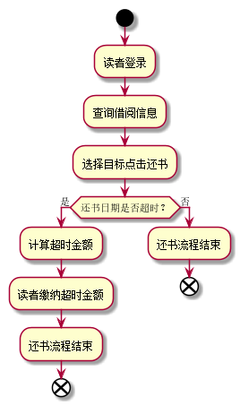
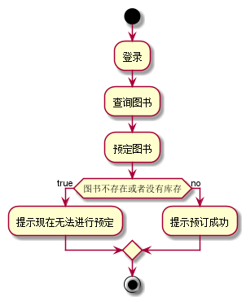
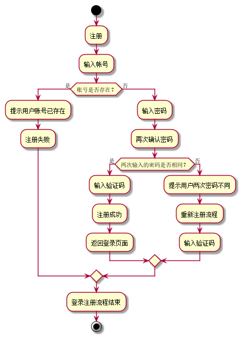

# 实验2 图书管理系统用例建模
|    学号    |       班级       |      姓名     |    照片    | 
|:-------:|:------------- | ----------:|----------:|
|   201510414412  |     2015级4班    |   楼轩恺   |  |
## 1. 图书管理系统的用例关系图

### 1.1 用例图PlantUML源码如下：

``` usecase
@startuml
Left to right direction
:图书管理员: as 1
:读者: as 2
:系统管理员: as 3
rectangle 图书管理系统{
1-->(登录)
1-->(查询图书信息)
1-->(更改图书信息)
1-->(借阅管理)
1-->(读者管理)
2-->(登录)
2-->(查询图书信息)
2-->(预定图书)
2-->(借书)
2-->(还书)
(发布新公告) <-- 3
(管理图书管理员) <-- 3
(维护系统) <-- 3
(登录) <-- 3
(查询图书信息) <-- 3
(更改图书信息) <-- 3
(借阅管理) <-- 3
(读者管理) <-- 3

(登录)<.(找回密码):<extends>
(借书)<.(续借):<extends>
(还书)<.(缴纳罚金):<extends>
}

@enduml
```
### 1.2 用例图如下：


## 2. 参与者说明：

###     2.1 图书管理员
```
主要职责：
一、图书管理员应严格执行图书管理的规章制度。
二、图书管理员要树立为职工服务的思想、钻研业务，掌握图书管理业务的基本技能，制定和执行书屋的管理工作。
三、具有完善的出版物进出登记台账，做好读者的图书出借和阅读工作，不断改进工作方法，简化借阅手续，提高图书流通率。
四、有计划、有原则地选购图书，订阅期刊，及时添购新书籍，书柜，保证图书经费的合理使用。
五、按照图书编目的要求，对藏书分类编目，新买的书刊及时分编上架，投入流通，不无故积压。
六、经常宣传新书内容，开展读书活动，做好书刊鉴别工作，严禁内容不健康的书刊出借和阅览。
七、爱护图书财产，定期查库账物要清，经常保持图书馆、阅鉴室和资料整洁通风，做好防虫、防潮、防灾、防盗等安全保护工作。
八、定期做好报纸、杂志的装订和保管工作，及时修补损坏的书籍杂志。
九、对读者做好爱护图书和遵守阅览室制度的宣传教育工作，并建立培养一支读者管理图书的服务队伍。
十、认真做好防盗、防火、防潮、防虫工作，搞好书库、借书室、阅览室的清洁卫生工作。
```
###     2.2 读者

```
主要职责：
一、应当保护书籍
二、借阅书籍之后及时归还
三、借阅的图书不二次外
四、丢失的书籍应当赔偿
```

###     2.3 系统管理员
    
```
主要职责：
维护整个系统的平稳运行
```

##     3. 用例规约表
### 3.1 "借出图书"用例

|用例名称|借出图书|  
|:------:|:------:|
|参与者|图书管理员（主要参与者）、借阅者（次要参与者）|
|前置条件|图书管理员已登录并且读者已在系统中|
|后置条件|更新数据库，显示该书籍已外借|
|主事件流|1.图书管理员将借阅者信息录入系统；2.系统验证读者身份和借书条件；3.图书管理员将读者所借图书输入系统；4.系统记录借书信息，并且修改图书的状态和此书的可借数量；5系统更新读者的借书数量；6.系统打印借书清单，交易成功完成|
|备注|1.一个读者最多只能同时借阅5本书;2.借阅图书时间默认一个月，续借时间同上,每本书最多被续借一次|

### "借出图书"用例流程图源码
```
@startuml
start;
:点击借阅;
if(是否有库存？) then(是)
if(是否超出借阅上限？) then(是)
:借书失败;
else(否)
:借书成功;
endif;
else(否)
:提示没有库存;
:借书失败;
endif;
end;
@enduml
```
### "借出图书"用例流程图

### 3.2 "归还图书"用例
 |用例名称|归还图书|  
|:------:|:------:|
|参与者|图书管理员（主要参与者）、借阅者（次要参与者）|
|前置条件|图书管理员已登录并且读者已在系统中|
|后置条件|读者成功还书|
|主事件流|1.读者查询借阅信息;2.系统显示读者借阅信息;3.读者选择目标书籍，并点击归还;4.系统验证该用户归还的书籍是否超时;5.如果超时读者则缴纳罚款;6.还书成功，流程结束|
|备注|借阅者可到管理员处还书，出示相应的借阅证，管理员便可帮借阅者归还该图书，若逾期不归还，管理员有权利按照规定罚款，严重者取消借阅资格|
### "归还图书"用例流程图源码
```
@startuml
start;
:读者登录;
:查询借阅信息;
:选择目标点击还书;
if(还书日期是否超时？) then(是)
:计算超时金额;
:读者缴纳超时金额;
:还书流程结束;
stop;
else(否)
:还书流程结束;
stop;
@enduml
```
### "归还图书"用例流程图

### 3.3 "预定图书"用例
 |用例名称|预定图书|  
|:------:|:------:|
|参与者|借阅者|
|前置条件|读者预订书籍|
|后置条件|读者成功预定图书|
|主事件流|1.读者登录查询图书;2.系统显示图书借阅情况;3.预订相应图书;4.向管理员发出请求;5.管理员进行进行预定操作;6.等待并获取图书|
|备注|一个读者同时只能预定3本书|
### "预定图书"用例源码
```
@startuml
start
:登录;
:查询图书;
:预定图书;
if(图书不存在或者没有库存) then (true)
    :提示现在无法进行预定;
    else (no)
    :提示预订成功;
    endif
stop
@enduml
```
### "预定图书"用例图

### 3.4 "注册"用例
 |用例名称|注册|  
|:------:|:------:|
|参与者|借阅者|
|前置条件|借阅者未拥有帐号|
|后置条件|成功注册|
|主事件流|1.读者点击注册;2.输入帐号密码;3.显示是否有相同帐号;4.注册成功|
|备注|无|
### "注册"用例源码
```
@startuml
start
:注册;
:输入帐号;
if(账号是否存在？) then(是)
:提示用户账号已存在;
:注册失败;
else(否)
:输入密码;
:再次确认密码;
if(两次输入的密码是否相同？) then(是)
:输入验证码;
:注册成功;
:返回登录页面;
else(否)
:提示用户两次密码不同;
:重新注册流程;
:输入验证码;
endif;
endif;
:登录注册流程结束;
stop;
@enduml
```
### "注册"用例图

