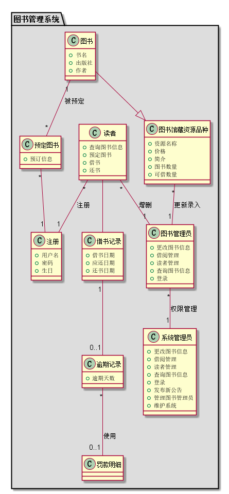
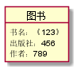
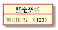
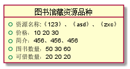
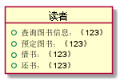
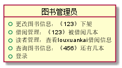
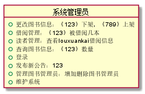
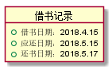
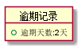
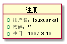

# 实验3 图书管理系统领域对象建模
|    学号    |       班级       |      姓名     |    照片    | 
|:-------:|:------------- | ----------:|----------:|
|   201510414412  |     2015级4班    |   楼轩恺   |  |
## 1. 图书管理系统的类图

### 1.1 类图PlantUML源码如下：

```
@startuml
package "图书管理系统" #DDDDDD{
class 系统管理员 {
       +更改图书信息
       +借阅管理
       +读者管理
       +查询图书信息
       +登录
       +发布新公告
       +管理图书管理员
       +维护系统
}
class 读者 {
      +查询图书信息
      +预定图书
      +借书
      +还书
}
class 注册{
      +用户名
      +密码
      +生日
}
class 图书管理员{
     +更改图书信息
     +借阅管理
     +读者管理
     +查询图书信息
     +登录
}
class 图书馆藏资源品种 {
   +资源名称
   +价格
   +简介
   +图书数量
   +可借数量
}
class 图书 {
   +书名
   +出版社
   +作者
}
class 预定图书 {
   +预订信息
}
class 借书记录{
   +借书日期
   +应还日期
   +还书日期
}
class 逾期记录{
   +逾期天数
}
class 罚款明细{
}
图书 --|> 图书馆藏资源品种
图书管理员"*"--"1"系统管理员:权限管理
图书馆藏资源品种"*"--"1"图书管理员:更新录入
读者"*"--"1"图书管理员:增删
读者"*"--"1"注册:注册
图书"1"--"*"预定图书:被预定
预定图书"*"--"1"注册
读者--借书记录
借书记录"1"--"0..1"逾期记录
逾期记录"*"--"0..1"罚款明细:使用
@enduml
```
### 1.2 类图如下：



### 1.3 类图说明:
~~~
该类图由各种实体类组成，参考实验二中的
用例图来设计各种类
~~~
## 2. 图书管理系统的对象图

###     2.1 类“图书”对象图
```
源码：
@startuml
object 图书 {
   书名：《123》
   出版社：456
   作者：789
}
@enduml
```

###     2.2 类“预定图书”对象图
```
源码：
@startuml
object 预定图书 {
          预订图书：《123》
       }
@enduml
```

###     2.3 类“图书馆藏资源品种”对象图
```
源码：
@startuml
object 图书馆藏资源品种 {
          +资源名称:《123》、《asd》、《zxc》
          +价格：10 20 30
          +简介：456、456、456
          +图书数量：50 30 60
          +可借数量：20 20 20
       }
@enduml
```

###     2.4 类“读者”对象图
```
源码：
@startuml
object 读者 {
             +查询图书信息：《123》
             +预定图书：《123》
             +借书：《123》
             +还书：《123》
       }
@enduml
```

###     2.5 类“图书管理员”对象图
```
源码：
@startuml
object 图书管理员{
            +更改图书信息：《123》下架
            +借阅管理：《123》被借阅几本
            +读者管理：查看louxuankai借阅信息
            +查询图书信息：《456》还有几本
            +登录
       }
@enduml
```

###     2.6 类“系统管理员”对象图
```
源码：
@startuml
object 系统管理员 {
              +更改图书信息：《123》下架，《789》上架
              +借阅管理：《123》被借阅几本
              +读者管理：查看louxuankai借阅信息
              +查询图书信息：《123》数量
              +登录
              +发布新公告：123
              +管理图书管理员：增加删除图书管理员
              +维护系统
       }
@enduml
```

###     2.7 类“借书记录”对象图
```
源码：
@startuml
object 借书记录{
          +借书日期：2018.4.15
          +应还日期：2018.5.15
          +还书日期：2018.5.17
       }
@enduml
```

###     2.8 类“逾期记录”对象图
```
源码：
@startuml
object 逾期记录{
          +逾期天数:2天
       }
@enduml
```

###     2.9 类“注册”对象图
```
源码：
@startuml
object 注册{
             +用户名：louxuankai
             +密码：******
             +生日：1997.3.19
       }
@enduml
```

###     2.10 类“罚款明细”对象图
```
源码：
@startuml
object 罚款明细{
             
       }
@enduml
```

