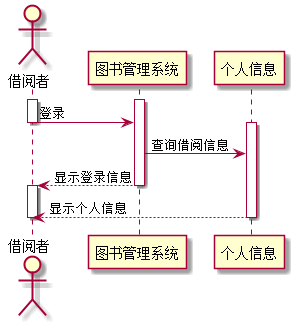
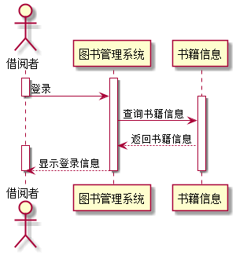
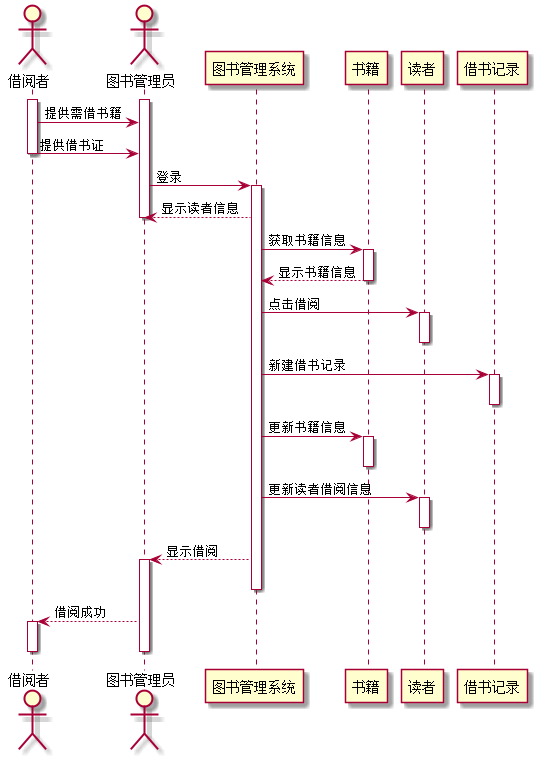
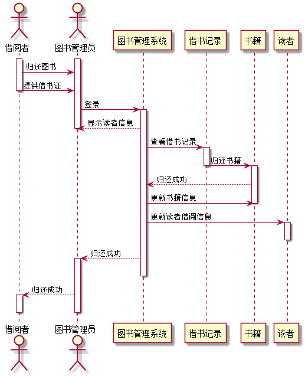
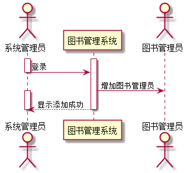
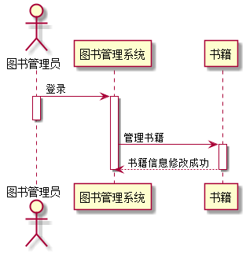

# 实验4：图书管理系统顺序图绘制
|    学号    |       班级       |      姓名     |    照片    | 
|:-------:|:------------- | ----------:|----------:|
|   201510414412  |     2015级4班    |   楼轩恺   |  |
## 1. 借阅者查询个人信息用例

### 1.1 查询个人信息用例PlantUML源码:

``` usecase
@startuml
actor  借阅者 as reader
activate reader
activate 图书管理系统
reader->图书管理系统:登录
deactivate reader
activate 个人信息
图书管理系统->个人信息:查询借阅信息
图书管理系统-->reader:显示登录信息
deactivate 图书管理系统
activate reader
个人信息-->reader:显示个人信息
deactivate 个人信息
deactivate reader
@enduml
```
### 1.2 查询个人信息用例顺序图：



### 1.3 查询个人信息用例顺序图说明:
~~~
1、借阅者登录系统 
2、借阅者查询自己的个人信息(借阅信息、个人资料等...)
3、向借阅者返回信息
~~~
## 2. 借阅者查询书籍信息用例

### 2.1 查询书籍信息用例PlantUML源码:

``` 
 @startuml
 actor  借阅者 as reader
 activate reader
 activate 图书管理系统
 reader->图书管理系统:登录
 deactivate reader
 activate 书籍信息
 图书管理系统->书籍信息:查询书籍信息
 书籍信息-->图书管理系统:返回书籍信息
 activate reader
 图书管理系统-->reader:显示登录信息
 deactivate 图书管理系统
 deactivate 书籍信息
 deactivate reader
 @enduml
```
### 2.2 查询书籍信息用例顺序图：



### 2.3 查询书籍信息用例顺序图说明:
~~~
1、借阅者登录系统 2、借阅者查询需要借阅的书籍信息
3、向借阅者返回书籍信息
~~~
## 3. 借阅者借书用例

### 3.1 借书用例PlantUML源码:

``` 
@startuml
actor  借阅者 as reader
actor  图书管理员 as admin
activate reader
activate admin
reader->admin:提供需借书籍
reader->admin:提供借书证
deactivate reader
admin->图书管理系统:登录
activate 图书管理系统
admin<--图书管理系统:显示读者信息
deactivate admin
图书管理系统->书籍:获取书籍信息
activate 书籍
图书管理系统<--书籍:显示书籍信息
deactivate 书籍
图书管理系统->读者:点击借阅
activate 读者
deactivate 读者
图书管理系统->借书记录:新建借书记录
activate 借书记录
deactivate 借书记录
图书管理系统->书籍:更新书籍信息
activate 书籍
deactivate 书籍
图书管理系统->读者:更新读者借阅信息
activate 读者
deactivate 读者
图书管理系统-->admin:显示借阅
activate admin
deactivate 图书管理系统
admin-->reader:借阅成功
activate reader
deactivate reader
deactivate admin
@enduml
```
### 3.2 借书用例顺序图：



### 3.3 借书用例顺序图说明:
~~~
1、借阅者向图书管理员提供需要借阅的书籍以及借书证 
2、图书管理员登录系统
3、系统返回借阅者信息 
4、系统获得借阅书籍信息 
5、图书管理员点击借阅
6、系统在借阅者个人信息内新建一条借阅信息 
7、系统更新书籍信息
8、系统更新借阅者信息  
9、显示借阅成功
~~~
## 4. 借阅者还书用例

### 4.1 还书用例PlantUML源码:

``` 
@startuml
actor  借阅者 as reader
actor  图书管理员 as admin
activate reader
activate admin
reader->admin:归还图书
reader->admin:提供借书证
deactivate reader
admin->图书管理系统:登录
activate 图书管理系统
admin<--图书管理系统:显示读者信息
deactivate admin
图书管理系统->借书记录:查看借书记录
activate 借书记录
借书记录->书籍:归还书籍
deactivate 借书记录
activate 书籍
图书管理系统<--书籍:归还成功
图书管理系统->书籍:更新书籍信息
deactivate 书籍
图书管理系统->读者:更新读者借阅信息
activate 读者
deactivate 读者
图书管理系统-->admin:归还成功
activate admin
deactivate 图书管理系统
admin-->reader:归还成功
activate reader
deactivate reader
deactivate admin
@enduml
```
### 4.2 还书用例顺序图：



### 4.3 还书用例顺序图说明:
~~~
1、借阅者向图书管理员归还图书并提供借阅证
2、图书管理员登录系统
3、系统返回借阅者信息
4、图书管理员查看借阅者借书记录
5、图书管理员点击归还图书
6、系统更新书籍信息
7、系统更新读者信息
8、显示归还成功
~~~
## 5. 系统管理员增加图书管理员用例

### 5.1 系统管理员增加图书管理员用例PlantUML源码:

``` 
@startuml
actor  系统管理员 as admin
activate admin
activate 图书管理系统
admin->图书管理系统:登录
deactivate admin
actor  图书管理员 as admin1
图书管理系统->admin1:增加图书管理员
activate admin
图书管理系统-->admin:显示添加成功
deactivate 图书管理系统
deactivate admin
@enduml
```
### 5.2 系统管理员增加图书管理员用例顺序图：



### 5.3 系统管理员增加图书管理员用例顺序图说明:
~~~
1、系统管理员登录系统
2、增加新的图书管理员
3、显示添加成功
~~~
## 6. 图书管理员管理书籍用例

### 6.1 图书管理员管理书籍用例PlantUML源码:

``` 
@startuml
actor 图书管理员
图书管理员 -> 图书管理系统:登录
activate 图书管理员
deactivate 图书管理员
activate 图书管理系统
图书管理系统-> 书籍:管理书籍
activate 书籍
图书管理系统<--书籍:书籍信息修改成功
deactivate 图书管理系统
deactivate 书籍
@enduml
```
### 6.2 图书管理员管理书籍用例顺序图：



### 6.3 图书管理员管理书籍用例顺序图说明:
~~~
1、图书管理员登录系统
2、进行书籍的管理
3、书籍信息修改成功
~~~
