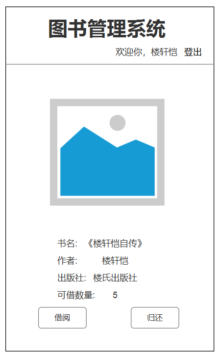

# 实验5：图书管理系统数据库设计与界面设计
|学号|班级|姓名|照片|
|:-------:|:-------------: | :----------:|:---:|
|201510414412|软件(本)15-4|楼轩恺||

## 1.数据库表设计

## 1.1. 图书馆藏资源品种表
|字段|类型|长度|允许空值|主键|
|:-------:|:-------------:|:------:|:----:|:---:|
|resource_id|int|20|否|是|
|resource_name|varchar|32|否|否|
|resource_price|double|6|否|否|
|resource_jianjie|varchar|20|是|否|
|resource_num|double|6|是|否|
|resource_kejienum|double|6|是|否|

## 1.2. 图书表
|字段|类型|长度|允许空值|主键|注释|
|:-------:|:-------------:|:------:|:----:|:---:|:-----|
|book_id|char|7|否|是|书籍编号|
|book_name|varchar|32|否|否|书籍名称|
|book_type|tinyint|1|否|否|类型|
|author|varchar|5|是|否|作者|
|press|varchar|20|是|否|出版社|
|price|double|5|否|否|单价|

## 1.3. 读者表
|字段|类型|长度|允许空值|主键|注释|
|:-------:|:-------------:|:------:|:----:|:---:|:-----|
|id|int|10|否|是|用户id（自增）|
|account|varchar|15|否|否|用户名|
|password|char|32|否|否|密码（md5加密）|
|nname|varchar|15|是|否|昵称|
|sex|tinyint|1|否|否|性别|
|birthday|date|10|是|否|出生年月|
|borrow_number|tinyint|1|否|否|已借数量（不大于5）|

## 1.4. 管理员表
|字段|类型|长度|允许空值|主键|注释|
|:-------:|:-------------:|:------:|:----:|:---:|:-----|
|sys_id|char|6|否|是|管理员id|
|account|varchar|15|否|否|用户名|
|password|char|32|否|否|密码（md5加密）|

## 1.5. 借阅归还表
|字段|类型|长度|允许空值|主键|注释|
|:-------:|:-------------:|:------:|:----:|:---:|:-----|
|borrow_id|int|10|否|是|借阅编号|
|book_id|char|10|否|是|书籍编号|
|borrow_time|timestamp|10|否|否|借阅时间|
|should_r_time|timestamp|10|否|否|应还时间|
|return_time|timestamp|10|否|否|归还时间|

## 1.6. 逾期罚款表
|字段|类型|长度|允许空值|主键|注释|
|:-------:|:-------------:|:------:|:----:|:---:|:-----|
|amerce_id|int|10|否|是|逾期id（自增）|
|borrow_id|int|10|否|否|读者编号|
|book_name|varchar|15|否|否|书籍名称|
|book_id|char|7|否|否|书籍编号|
|borrow_time|datetime|10|否|否|借阅时间|
|should_r_time|datetime|10|否|否|应还时间|
|return_time|datetime|10|否|否|归还时间|
|fines|double|10|否|否|逾期金额|

***

## 2. 界面设计
## 2.1. 首页设计

- 用例图参见：个人信息用例
- 类图参见：个人信息类
- 顺序图参见：个人信息顺序图
- API接口如下：

1. 注册登录API

- 功能：进行登录或者注册
- 请求地址： http://api.test5.com/v1/api/index
- 请求方法：POST
- 请求参数：

|参数名称|必填|说明|
|:-------:|:-------------: | :----------:|
|account|是|用户名|
|password|是|密码|
|birthday|是|生日|

- 返回实例：
```
{
    "info": "登录成功。",
    "data": 
        {
            "id": "LXK123",
            "account":"louxuankai",
            "password":"123456",
            "birthday":"19970319",
        },
        "code": 200
}
```
- 返回参数说明：
    
|参数名称|说明|
|:-------:|:-------------: |
|info|显示登录成功|
|data|用户登录信息|
|code|返回码|

## 2.2. 个人信息页面设计

- 用例图参见：个人信息用例
- 类图参见：读者类
- 顺序图参见：读者顺序图
- API接口如下：

1. 个人信息API

- 功能：用于获取读者的个人信息
- 请求地址： http://api.test5.com/v1/api/reader
- 请求方法：POST
- 请求参数：

|参数名称|必填|说明|
|:-------:|:-------------: | :----------:|
|id|是|读者编号|
|account|是|读者账号|
|nname|否|读者昵称|
|birthday|否|读者生日|

- 返回实例：
```
{
    "data": 
        {
            "id": "LXK123",
            "account":"louxuankai",
            "nname":"LXK",
            "birthday":"19970319",
        },
        "code": 200
}
```
- 返回参数说明：
    
|参数名称|说明|
|:-------:|:-------------: |
|data|读者的详细信息|
|code|返回码|

## 2.3. 借阅信息页面设计

- 用例图参见：借阅用例
- 类图参见：借阅类
- 顺序图参见：借阅图书顺序图
- API接口如下：

1. 借阅信息API

- 功能：提供借阅界面
- 请求地址： http://api.test5.com/v1/api/borrow
- 请求方法：POST
- 请求参数：

|参数名称|必填|说明|
|:-------:|:-------------: | :----------:|
|id|是|读者编号|

- 返回实例：
```
{
    "info": "借阅成功。",
    "data": 
        {
            "id": "LXK123",
            "resource_kejienum":"5",
        },
        "code": 200
}
```
- 返回参数说明：
    
|参数名称|说明|
|:-------:|:-------------: |
|info|显示借阅成功|
|data|可借数量|
|code|返回码|
