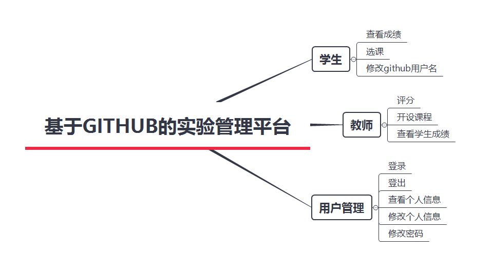
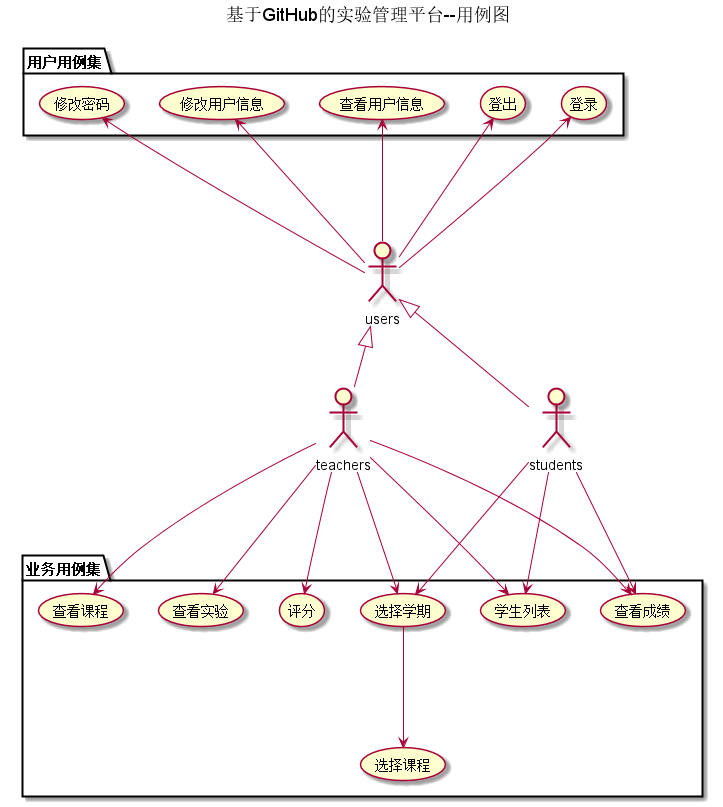

# 基于GitHub的实验管理平台的分析与设计

### 成都大学信息科学与工程学院

|学号|班级|姓名|照片|
|:-------:|:-------------: | :----------:|:---:|
|201510414412|软件(本)15-4|楼轩恺|无|

## 1. 概述
- 基于GitHub的实验管理平台的作用是在线管理实验成绩的Web应用系统。学生和老师的实验内容均存放在GitHUB
页面上。
- 学生的功能主要有：一是设置自己的GitHub用户名，二是查询自己的每个学期的实验成绩。学生的GitHub用户名是公开的，但成绩不公开。三是进行选课，但是必须在老师选完之后才能进行选课。
- 老师的功能主要有：一是批改每个学生的成绩，二是查看每个学生的成绩，三是进行每学期选课,四是增加不同课程
- 老师和学生都能通过本系统的链接方便地跳转到学生的每个GitHUB实验目录，以便批改实验或者查看实验情况。
- 实验成绩按数字分数计算，每项实验的满分为100分且每项都由具体评分项组成，最低为0分。
- 系统自动计算每个学生的所有实验的平均分。
    
## 2. 系统总体结构

界面设计参见：https://louxiankai0.github.io/is_analysis/test6/ui/index.html
    
## 3. 用例图设计 [源码](src/用例图.puml)

## 4. 类图设计 [源码](src/类.puml)

## 5. 数据库设计
- ### [参见数据库设计](./数据库设计.md)

## 6. 用例及界面详细设计
- ### [“学生列表”用例](./用例/学生列表.md),[界面](https://louxiankai0.github.io/is_analysis/test6/ui/首页1.html)
- ### [“评定成绩”用例](./用例/评定成绩.md),[界面](https://louxiankai0.github.io/is_analysis/test6/ui/评定成绩.html)
- ### [“查看成绩”用例](./用例/查看成绩.md),[界面](https://louxiankai0.github.io/is_analysis/test6/ui/查看成绩.html)
- ### [“修改密码”用例](./用例/修改密码.md),[界面](https://louxiankai0.github.io/is_analysis/test6/ui/修改github名称或密码.html)
- ### [“修改用户信息”用例](./用例/修改信息.md),[界面](https://louxiankai0.github.io/is_analysis/test6/ui/修改github名称或密码.html)
- ### [“查看用户信息”用例](./用例/查看信息.md),[界面](https://louxiankai0.github.io/is_analysis/test6/ui/查看个人信息.html)
- ### [“登出”用例](./用例/登出.md),[界面](https://louxiankai0.github.io/is_analysis/test6/ui/首页1.html)
- ### [“登录”用例](./用例/登录1.md),[界面](https://louxiankai0.github.io/is_analysis/test6/ui/登录.html)
- ### [“选择学期”用例](./用例/选择学期.md),[界面](https://louxiankai0.github.io/is_analysis/test6/ui/学期.html)
- ### [“选择课程”用例](./用例/选择课程.md),[界面](https://louxiankai0.github.io/is_analysis/test6/ui/选课/学生.html)
    