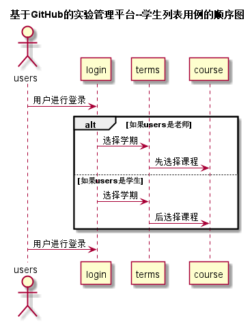

# “选择课程”用例 [返回](../README.md)
## 1. 用例规约

|用例名称|评定成绩|
|-------|:-------------|
|功能|用户登录之后可以选择该学期下的任意课程|
|参与者|老师、学生|
|前置条件|用户必须先登录，老师必须先进行选课，学生才能选择这一门课程|
|后置条件| 选课提交之后，系统自动更新该课程剩余人数|
|主事件流| 1. 老师进行登录   2. 老师进行选课    3. 提交    4. 学生登录  5. 学生进行选课|
|备选事件流|无|

## 2. 业务流程（顺序图） [源码](../src/选择课程.puml)
 

    
## 3. 界面设计
- 界面参照: https://louxiankai0.github.io/is_analysis/test6/ui/选课/教师.html  
            https://louxiankai0.github.io/is_analysis/test6/ui/选课/学生.html

- API接口调用

    - 接口：[chooseCourse](../接口/chooseCourse.md)
        
        用于选择课程
        
## 4. 算法描述
    无
    
## 5. 参照表

- [TEACHERS](../数据库设计.md/#TEACHERS)
- [STUDENTS](../数据库设计.md/#STUDENTS)
- [COURSE](../数据库设计.md/#COURSE)
- [TERMS](../数据库设计.md/#TERMS)
- [LOGIN](../数据库设计.md/#LOGIN)

